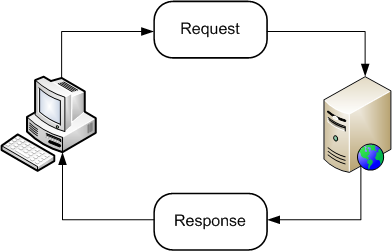

# Java 
## Random Java Stuff
### Polymorphism 
Abstract classes and methods are inherited and implemented in children classes. Creates a logical tree showing a hierarchy of functionality. This allows for more extendable and generic code.

In java, you can inherit many interfaces.

```Java
public Abstract class Shape {
    abstract void draw();
}

public class Circle extends Shape {
    @Override 
    public void draw() {
        // ... draw the circle
    }
}

public class Square extends Shape {
    @Override 
    public void draw() {
        // ... draw the square
    }
}
```

## Java EE 
### Overview 
3 Versions of Java
* EE: Enterprise Edition 
* SE: Standard Edition 
* ME: Mobile Edition 

This is something you should know 


Relationship between server and client 


### Servlet 
Server side applet 

A simple hello world Servlet using doGet method
```java
// First server-side program that simply says hello and displays its date/time

import java.io.*;
import javax.servlet.*; // notive the x in javax
import javax.servlet.http.*;

public class MyFirstServletNow extends HttpServlet {

    public void doGet (HttpServletRequest request,HttpServletResponse response) throws ServletException, IOException { 
        response.setContentType("text/html"); // sending HTML 
        PrintWriter out = response.getWriter();
        out.println("<html>"); 
        out.println("<head><title>First Servlet</title></head>"); 
        out.println("<body>"); 
        out.println("<h1>Welcome to our store! Our date/time is " + new java.util.Date() + "</h1>");
        out.println("</body></html>"); 
    } 
}

```

using request method to look for form parameters 
```java

public void doGet (HttpServletRequest request,HttpServletResponse response) throws ServletException, IOException { 
    response.setContentType("text/html"); // sending HTML 
    PrintWriter out = response.getWriter();
    String first = request.getParameter("firstName");
    String last = request.getParameter("lastName");

    ...
}
```

calling a server Servlet in HTML that's running on the local host (this machine). This is called a loop back. 
```html 
<form methods="get" action="http://localhost:8080/ServletToProcessEmail/TheServlet" >
```

The server must be RAN so that the browser knows where to go... it needs to exist

###Namespace
allows you to enter a specific context of a code package or module to remove ambiguity/ having multiple namespace's with the same methods.

this is how it is done in xhtml
```xml
    xmlns:h="http://java.sun.com/jsf/html"
    <h:form></h:form>
```


