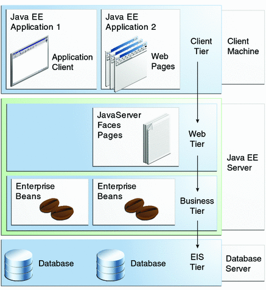

# Java 
## Random Java Stuff
### Polymorphism 
Abstract classes and methods are inherited and implemented in children classes. Creates a logical tree showing a hierarchy of functionality. This allows for more extendable and generic code.

In java, you can inherit many interfaces.

```Java
public Abstract class Shape {
    abstract void draw();
}

public class Circle extends Shape {
    @Override 
    public void draw() {
        // ... draw the circle
    }
}

public class Square extends Shape {
    @Override 
    public void draw() {
        // ... draw the square
    }
}
```

## Java EE 
3 Versions of Java
* EE: Enterprise Edition 
* SE: Standard Edition 
* ME: Mobile Edition 

This is something you should know 



### Servlet 
Server side applet 

